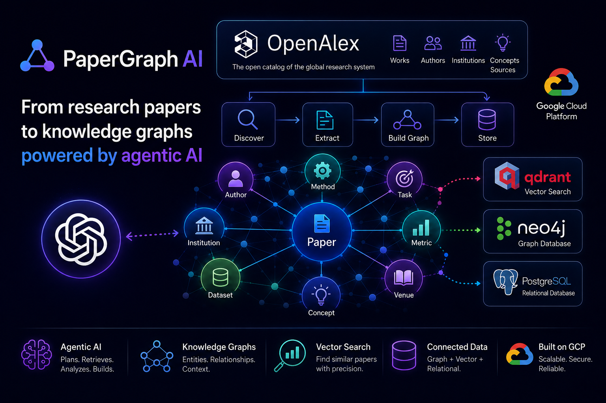

# PaperGraph AI

[](https://github.com/vsokoltsov/papergraph-ai/actions/workflows/ci.yml)
[](https://codecov.io/gh/vsokoltsov/papergraph-ai)




## 🧩 Problem Description


PaperGraph AI helps researchers explore scientific papers from OpenAlex with an agentic AI
workflow. The app ingests paper metadata and abstracts, stores semantic content in Qdrant, stores
paper relationships in Neo4j, and lets an LLM agent combine vector retrieval with graph context.

The main goal is to answer research questions such as:

- Which papers discuss a specific topic?
- How do papers relate by topic, source, author, institution, or citation?
- What are the main research directions across a retrieved set of papers?

The system is built around an automated ingestion pipeline, an agentic retrieval layer, evaluation
scripts, feedback collection, and Grafana monitoring dashboards.

## 🔎 Retrieval Features

PaperGraph AI implements the bonus retrieval features explicitly:

- **Hybrid search**: the evaluated `vector_plus_graph` approach retrieves semantic matches from
  Qdrant first, then enriches selected OpenAlex papers with Neo4j graph context.
- **User query rewriting**: the agent has a `rewrite_search_query` tool that converts a natural
  language question into a compact retrieval query before database search.
- **Document re-ranking**: the agent has a `rerank_documents` tool that reorders retrieved
  candidates using question-term overlap plus the backend retrieval score.

The LLM evaluation compares `vector_only`, `graph_only`, and `vector_plus_graph`, while the
retrieval evaluation compares Qdrant vector search, Neo4j graph search, and the combined
vector-plus-graph strategy.

The research agent itself is implemented as an explicit LangGraph workflow:

```text
rewrite query -> retrieve documents -> rerank documents -> fetch graph context -> generate answer
```

This keeps tool usage predictable, prevents unnecessary repeated retrieval calls, and makes each
agent step visible in the streamed research events.

## 💬 UI Interface

The user interface is a Streamlit chat app.

It provides:

- A chat input for research questions.
- Real-time agent progress in the research section.
- Final answers generated from retrieved paper context.
- Feedback buttons for marking answers as useful or not useful.
- Backend streaming from the FastAPI API to the UI.

Local URLs:

- 🖥️ Streamlit UI: `http://localhost:8501`
- 🚀 FastAPI backend: `http://localhost:8000`
- 📊 Grafana dashboards: `http://localhost:3000`
- 📈 Prometheus: `http://localhost:9090`
- 🧠 Neo4j Browser: `http://localhost:7474`
- 🔎 Qdrant API: `http://localhost:6333`

## 🚀 How To Run The Project

Install dependencies:

```bash
uv sync
```

Start the infrastructure:

```bash
docker compose up -d
```

Run migrations:

```bash
uv run alembic upgrade heads
```

Ingest papers from OpenAlex with dlt:

```bash
uv run python -m app.ingestion.run "mathematics" --limit 10
```

Start the backend locally:

```bash
make backend
```

Start the UI locally:

```bash
make ui
```

Alternatively, the API and UI are also included in `docker-compose.yml`, so a full Docker run is:

```bash
docker compose up -d --build
```

Run checks:

```bash
make check
```

## 🔌 API Contracts

Base URL for local development: `http://localhost:8000`.

### `GET /health`

Checks whether the API process is running.

Response:

```json
{
  "status": "ok"
}
```

### `POST /agent/runs`

Runs the research agent and returns the complete answer after the run finishes.

Request:

```json
{
  "question": "Which papers discuss graph retrieval augmented generation?"
}
```

Response:

```json
{
  "run_id": "29611bb8-d0cd-4546-90e4-5cc39b405b58",
  "answer": "Summary...\n\nKey papers...",
  "events": [
    {
      "type": "run_start",
      "input": {
        "question": "Which papers discuss graph retrieval augmented generation?"
      }
    },
    {
      "type": "tool_start",
      "tool": "search_vector_database",
      "input": {
        "query": "graph retrieval augmented generation",
        "limit": 5
      }
    },
    {
      "type": "tool_end",
      "tool": "search_vector_database",
      "output": {
        "count": 5
      }
    },
    {
      "type": "run_end",
      "output": {
        "answer": "Summary...\n\nKey papers..."
      }
    }
  ]
}
```

### `POST /agent/runs/stream`

Runs the research agent and streams progress as Server-Sent Events. The request body is the same
as `POST /agent/runs`.

Request:

```json
{
  "question": "Which papers discuss graph retrieval augmented generation?"
}
```

Each streamed item is emitted as an SSE `data:` event containing JSON:

```text
data: {"type":"status","message":"Running agent"}

data: {"type":"agent_event","event":{"type":"tool_start","tool":"search_vector_database","input":{"query":"graph retrieval augmented generation","limit":5}}}

data: {"type":"done","run_id":"29611bb8-d0cd-4546-90e4-5cc39b405b58","answer":"Summary...\n\nKey papers...","events":[...]}
```

On failure the stream emits:

```text
data: {"type":"error","message":"Error message"}
```

### `POST /feedback`

Stores user feedback for a completed agent run.

Request:

```json
{
  "run_id": "29611bb8-d0cd-4546-90e4-5cc39b405b58",
  "rating": "thumbs_up",
  "comment": "Useful answer with relevant papers."
}
```

`rating` must be either `thumbs_up` or `thumbs_down`. `comment` is optional.

Response:

```json
{
  "status": "ok"
}
```

## 🧰 MCP Server

PaperGraph AI exposes a local MCP server so MCP-compatible clients can use the same paper search,
graph context, ingestion, and agent workflow as the API and UI.

Run it with stdio transport:

```bash
make mcp
```

Available MCP tools:

- `search_papers`: semantic search over stored Qdrant paper titles and abstracts.
- `search_paper_graph`: keyword search over stored Neo4j paper metadata and relationships.
- `get_paper_graph_context`: graph context lookup for OpenAlex paper IDs.
- `ingest_openalex_papers`: search OpenAlex and store results in Qdrant and Neo4j.
- `ask_papergraph`: run the full PaperGraph research agent and return the answer plus events.

When Logfire is enabled, MCP tool calls emit structured `mcp.*` spans with bounded query/question
attributes and result counts.

Suggested commit split for this MCP feature:

- `Add MCP SDK dependency`: `pyproject.toml`, `uv.lock`
- `Add PaperGraph MCP server`: `app/mcp.py`, `tests/test_mcp.py`
- `Document MCP server command`: `Makefile`, `README.md`

## 📡 Observability

Local observability uses Prometheus, Grafana, and Tempo from `docker-compose.yml`.

External observability can also be sent to Pydantic Logfire. Set the Logfire write token in `.env`:

```bash
LOGFIRE_ENABLED=true
LOGFIRE_TOKEN=your-logfire-write-token
```

`LOGFIRE_TOKEN` is the official Logfire environment variable. The app also accepts
`LOGFIRE_API_KEY` for compatibility with older local `.env` files.

When enabled, the app configures Logfire once in `app/tracing.py`, instruments FastAPI requests,
HTTPX calls, OpenAI SDK calls, and failed Pydantic validations, and forwards existing OpenTelemetry
spans to Logfire. If `OTEL_TRACING_ENABLED=true`, the same spans are also exported to the local
OTLP endpoint used by Tempo.

## LLM Evaluation

The project uses the course-style LLM evaluation flow:

1. Ingest papers into Qdrant and Neo4j.
2. Use the committed frozen ground-truth examples in `app/eval/llm/llm_dataset.json`.
3. Run the real PaperGraph agent for each evaluation question.
4. Use an LLM-as-a-judge to compare the generated agent answer with the ground-truth answer.
5. Use the same judge to evaluate the agent trajectory, meaning the tool calls made before the final answer.

The generated ground-truth dataset has this shape:

```json
{
  "question": "What does this paper say about graph retrieval?",
  "answer_orig": "Ground-truth answer generated from the source paper data.",
  "document": "https://openalex.org/W..."
}
```

`answer_orig` is the expected answer. `answer_agent` is produced later by running the actual app agent. The evaluator sends both answers, the original question, the source document ID, and the recorded tool calls to the judge.

### Compared Approaches

LLM evaluation compares three retrieval/tool-use variants:

- `vector_only`: the agent can only use Qdrant vector search.
- `graph_only`: the agent can only use Neo4j graph search and graph context.
- `vector_plus_graph`: the agent uses Qdrant vector search first, then Neo4j graph context for the returned OpenAlex IDs.

The evaluation summary reports `answer_good_rate` and `trajectory_good_rate` per approach. The best approach should be selected from the current evaluation output. At this stage, `vector_only` is the default baseline to beat, while `vector_plus_graph` is useful when the graph context improves the answer without adding unnecessary tool calls.

The frozen dataset intentionally mixes direct paper questions, semantic paraphrases, and cross-paper graph-context questions. This avoids evaluating only exact title or abstract keyword lookup. The graph-context questions ask the agent to compare papers by topic, application domain, and relationship-style context, which is where `vector_plus_graph` should have an advantage over pure vector search.

### Run Locally

Start databases and run migrations:

```bash
docker compose up -d qdrant neo4j postgres
uv run alembic upgrade heads
```

Ingest papers:

```bash
uv run python -m app.cli "knowledge graph based retrieval augmented generation" --limit 10
```

Run the cheap LLM smoke evaluation from the committed frozen dataset:

```bash
uv run python -m app.eval.llm.evaluate \
  --dataset app/eval/llm/llm_dataset.json \
  --output-format markdown \
  --limit 2 \
  --approaches vector_only vector_plus_graph
```

Run the full LLM evaluation locally when you need benchmark numbers:

```bash
uv run python -m app.eval.llm.evaluate \
  --dataset app/eval/llm/llm_dataset.json \
  --output-format markdown
```

Write Markdown and JSON artifacts from the same evaluator run:

```bash
uv run python -m app.eval.llm.evaluate \
  --dataset app/eval/llm/llm_dataset.json \
  --output-format markdown \
  --output-dir eval-results
```

To regenerate candidate ground-truth data locally, ingest the focused query first and then run:

```bash
uv run python -m app.eval.llm.ground_truth.evaluate \
  --source qdrant \
  --limit 10 \
  --questions-per-document 1 \
  --output app/eval/llm/generated_dataset.json
```

Generated datasets and evaluation outputs are ignored by Git. The committed LLM dataset is intentionally frozen so CI runs can be compared across builds. If a regenerated dataset is better, review it manually before replacing `app/eval/llm/llm_dataset.json`.

### CI

GitHub Actions runs an `llm-eval` job after tests. The job starts Qdrant and Neo4j, runs migrations, ingests a focused batch of Graph RAG papers, runs the LLM judge against the frozen dataset, writes the markdown summary to the Actions summary, and uploads JSON/markdown artifacts generated from the same evaluator run.

Push and pull-request builds run only the smoke LLM evaluation: two questions and the `vector_only` / `vector_plus_graph` approaches. Use the manual `workflow_dispatch` run with `llm_eval_mode=full` for the complete LLM benchmark.

The job is marked `continue-on-error` because it depends on external services and API keys. This keeps normal CI useful while still producing evaluation artifacts when the environment is available.
